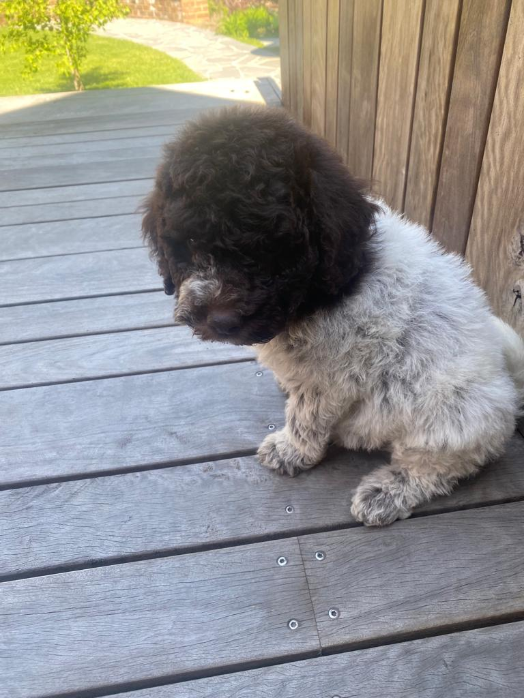

# Image Altar

#### Video Demo:  https://youtu.be/rZBCcBunaYA
#### External Libraries required:    
    numpy
    cairo
    PIL
## Introduction
This is Image Altar, my final project for the CS50P course.

I wanted to produce something for this final project that would be very different to something I would produce for work, 
so I settled on a bitmap image altering toy with a variety of features.  
The program uses Pillow and Pycairo (two libraries I hadn't really been exposed to previously) to read in a bitmap image 
file, and to re-render it as a vector image which replaces blocks of the bitmap in some form, lending the colour of the 
block to the new replacement symbol, with the intent to still evoke the previous image.  
I attempted to structure Image Altar in such a way that it could readily have additional transformation outputs added 
later, but have submitted it with 5 (maybe 5.5...) different transformations (examples of each below).
I opted to use argparse for this project to get more used to terminal implementations and argparse specifically.

Really, once I had a grasp of pycairo, this project ended up being more about geometry than programming, so it might not 
have been the best choice. Effort was taken to implement the program as robustly as possible and to produce a decent 
product, so despite the eventual simplicity of the problems tackled, the goal of producing something "complete" lead to 
decent learnings.

## Image Altar Functions
    main()
    Enacts a "mode" function according to what is specified in the command line arguments, and feeding arguments to the 
    mode function.
    
    check_filename(filename) 
    Verifies that the output file specified in the argument does not already exist, and if it 
    does, prompts the user for confirmation, accepting "Yes, Y, No, N" case insensitively, or reprompting. If response 
    is accepted, it returns True or False accordingly.
    Returns Bool

    pixellate(image: str, blocksize=15)
    Reads in a bitmap image input such as a .png or .jpg and converts it to an 
    array that has been reduced into blocks of blocksize x blocksize with average RGB information in each block.
    Returns pixellated array

    distribute_both_ends(crop: int) 
    This take an integer input, then returns a list with length equivalent to the input 
    where the first half are positive integers from 0, and the second half are negative integers down from 1. The intent
    is that these integers can be fed back in to the pixellate function to delete pixels that remain after dividing 
    length and height of the original image by the blocksize, but equally from both left and right, and top and bottom.
    Returns the list

    pix_to_image(pix_array: np.array, gscale=False, filename='output.png')
    Saves an image that has been operated on during "pixellate" to an output file. The gscale argument determines if the
    output will be coloured for grayscale.
    Returns nothing

    setup_vector_draw(cmap: np.array, res: int, filename="output.svg")
    Organizes a cairo SVGSurface and Context for svg creation by most operation modes, and changes an input RGB colour 
    map array (cmap) to a (0 - 1) array.
    Returns the new surface, context, and cmap

    grayscale(cmap: np.array)
    Changes an RGB or a (0 - 1) colour map to grayscale, by averaging each tuple in the array and inputting the averages 
    to each part of that tuple. 
    Returns the scaled or not scaled cmap

    draw_bg(colour: float, width: int, height: int, ctx)
    Draws a background rectangle on an svg context (ctx) with colour specified by colour between 0 and 1. If colour 
    exceeds 1, os is less than 0, the background is not drawn, and will remain transparent.

    draw_circle(cmap: np.array, res: int, gscale=False, filename="output.svg", background=5)
    Maps a bitmap array to circles as shown in the details for mode "Circles" below, by drawing 1 circle for each block 
    created by the pixellate function, with radius 0.5, and colour from the input array.
    Background is transparent by default, and grayscale is disabled by default.
    Size of the SVG output is specified by res.
    Returns nothing

    draw_stars(cmap: np.array, res: int, gscale=False, filename="output.svg", background=5, spin_angle=10)
    Maps a bitmap array to stars as shown in the details for mode "Stars" below, by drawing 1 star for each block 
    created by the pixellate function, with colour from the input array. Sequential stars, and sequential rows of stars
    are rotated by spin_angle in degrees.
    Background is transparent by default, and grayscale is disabled by default.
    Size of the SVG output is specified by res.
    Returns nothing

    draw_dot_map(cmap: np.array, res: int, filename="output.svg", background=5, colour=(0, 0, 0)
    Maps a bitmap array to circles as shown in the details for mode "Dotty" below, by drawing 1 circle for each block 
    created by the pixellate function, with radius from the input array. Circle colour is specified by RGB values 
    specified in colour.
    Background is transparent by default.
    Size of the SVG output is specified by res.
    Returns nothing

    arrows(cmap: np.array, res: int, line_width=0.2, arrow_length=0.7, end_length=0.3, gscale=False, 
           filename="output.svg", background=5)
    Maps a bitmap array to Arrows as shown in the details for mode "Arrows" below, by drawing 1 arrow for each block 
    created by the pixellate function, with geometry specified by line_width, arrow_length and end_length. Arrow colour 
    is specified by the input array. Arrows alternate from pointing to the right, to pointing upward, both by column and 
    row.
    Background is transparent by default. Grayscale is disabled by default.
    Size of the SVG output is specified by res.
    Returns nothing

    squiggles(cmap: np.array, res: int, line_width=0.5, gscale=False, filename="output.svg", background=5)
    Maps a bitmap array to connected squiggly lines as shown in the details for mode "Squiggles" below, by drawing 1 
    line for each block created by the pixellate function, with size specified by line_width. Squiggle colour 
    is specified by the input array. Squiggles join to their neighbours in a North-West to South-East direction.
    Background is transparent by default. Grayscale is disabled by default.
    Size of the SVG output is specified by res.
    Returns nothing
## Usage
Image Altar uses argparse to run through a terminal, -h output below:

    usage: project.py [-h] [-o O] [-m M] [-r R] [-s S] [-g G] [-bg BG] [-cc CC CC CC] f         
                                                                                            
    positional arguments:                                                                       
      f             Filename of image to alter

    options:
      -h, --help            show this help message and exit
      -o O                  Filename of output image (extension not required)
      -m {arrows,pixelize,circles,dotty,squiggles,stars}
                            Select Mode
      -r R                  Number of pixels to pixelate image by (Integer)
      -s S                  Size of Vector Image
      -g G                  Enable Grayscale (True or False)
      -bg BG                Enable Background Shade, between 0 and 1, default is transparent
      -cc CC CC CC          RGB Code for circle colours (Dotty mode only)
      -sa SA                Spin angle in degrees for stars mode (default is no spin)

The input filename must always be specified. By default, the output image will use the name "output" with the extension 
".png" or ".svg" depending on the mode of the program. A check is in place to verify that the output will not 
overwrite a file without user confirmation.

Examples of each of the different operation modes are shown below.

### Pixelize
If no mode is specified, the "pixelize" mode is selected by dafault. Fundamentally, the pixellize mode is a side effect 
of the program itself, rather than an intended useful output. It simply reads in a bitmap image, and then creates a new 
pixellated bitmap from it with pixels of the specified size, of the average colour of the block. Remaining pixels of the
original image that would not fit evenly into the new array are discarded evenly from each edge of the original image.  
There are existing interpolative functions that exist within pillow for this purpose that could have been used instead, 
but I actively chose to write my own algorithm for both the challenge (this is an exercise in education after all) and 
to have full control of the output array.  
The key option for pixelize is -r (default is 20), which controls the number of pixels in the square block (sized r x r) 
that is used to pixelize the original image.

Example of pixelize output below:
> python project.py Readme_Photos/Olive.jpg -r 20

|            Original picture of Olive             |      python project.py Dog_Photos/Olive.jpg -r 20      |      python project.py Dog_Photos/Olive.jpg -r 30      |
|:------------------------------------------------:|:------------------------------------------------------:|:------------------------------------------------------:|
|  |  |  |

### Circles
The simplest mode, circles replaces each pixel block with a circle reflecting the colour of the block. This mode works 
with grayscale and background options. Circles are of uniform size with connecting edges. Produces a mosaic like effect.
A potential use for this is for mapping images for "Diamond dots", a creative mindfulness activity of placing small 
beads together to create a mosaic image, which match edge to edge in the same manner.

Example of circles output below:
> python project.py Readme_Photos/Chewie.jpg -m circles -s 10

|            Original picture of Chewie             | python project.py Dog_Photos/Chewie.jpg -m circles -s 10  |
|:-------------------------------------------------:|:---------------------------------------------------------:|
|  |  |

### Dotty
The Dotty mode replaces the pixels of a grayscale image with circles of varying radii according to shade, where the 
darkest shades will have the largest circles, and the lightest shades will have the smallest.
The mode has a transparent background by default, but is typically effective with black dots on a white background. The 
-cc option colours the circle colours to a specified RGB value rather than the default of black.

Example of dotty output below:
> python project.py Readme_Photos/Olive_View.jpg -m dotty -r 10 -bg 1

|               Original picture of Olive               | python project.py Dog_Photos/Olive_View.jpg -m dotty -r 15 -bg 1 |
|:-----------------------------------------------------:|:----------------------------------------------------------------:|
|  |            |

### Arrows
The Arrows mode was the original inspiration, with additional modes being easily introduced around this one. This mode 
replaces pixel blocks with arrows, alternating continuously across the image from pointing to the right, to pointing 
upward, then shifting the sequence for the following row.
The mode has a transparent background by default, but is typically most effective with a black background.

Example of arrows output below:
> python project.py Readme_Photos/Olive_View.jpg -m dotty -r 10 -bg 1

|              Original picture of Rex               | python project.py Dog_Photos/Rex_Red.jpg -m arrows -r 15 -bg 0 |
|:--------------------------------------------------:|:--------------------------------------------------------------:|
|  |           |

### Squiggles
The squiggles mode was a late addition, running connected lines between blocks of pixels that change colour with the 
block. The lines run from the top-left most corner to the bottom-right. This mode comes with expected functionality 
such as grayscale and background options, but doesn't need the background to be effective.
The blocks in this mode actually interfere with eachother somewhat, but squiggles do not overlap at any stage.

Example of squiggles output below:
> python project.py Readme_Photos/Chewie_Bed.jpg -m squiggles -r 25

|              Original picture of Chewie               | python project.py Dog_Photos/Chewie_Bed.jpg -m squiggles -r 25 |
|:-----------------------------------------------------:|:--------------------------------------------------------------:|
|  |     |

### Stars
The stars mode replaces pixel blocks with stars, very similar in concept to the circles mode. 
The major difference comes from the optional argument -sa which specifies an amount of spin from star to star in degrees.
This rotates each consecutive star, or row of stars, by the specified angle. It also shifts the origin of the point of 
the star slightly from the expected perfect rotation, which introduces an interference effect, by causing different 
stars to become closer to eachother than others. This effect could, and probably SHOULD be implemented in the circles 
mode as well. Smaller angles of spin tend to work better than others, but experimentation is recommended.

Example of stars output below:
> python project.py Readme_Photos/Rex_REB.jpg -m stars -bg 0 -sa 15

|              Original picture of Rex               | python project.py Dog_Photos/Rex_REB.jpg -m stars -bg 0 | python project.py Dog_Photos/Rex_REB.jpg -m stars -bg 0 -sa 15 |
|:--------------------------------------------------:|:-------------------------------------------------------:|:--------------------------------------------------------------:|
|  |   |         |        |

## Test Program
There is an associated unit test for Image Altar, one note on its use is that the unit test requires that the file 
'test.png' does not exist in the code directory, as it quickly produces small images and deletes them to verify 
operation. It also requires that a file 'DONT NAME A FILE THIS OR YOU WILL BREAK THE PYTEST.png' does NOT exist in the 
directory, to test operation when failing to find intended file input.

## To Do
- Add remaining functions for testing to the unit test program
- Add additional modes with time

## Thanks to CS50P
Link to information for the CS50P course which inspired this project can be found at https://cs50.harvard.edu/python/2022/
Note to potential CS50P reviewers (which I know don't really exist), to not encounter issues with space, when I uploaded 
this for the course I did not upload all the example readme images, a better version of the readme can be found at my 
github repository below.

## Contact
Shannon Egan - shan@egan.mobi

Link to project - https://github.com/ShannonEgan0/image_altar.git